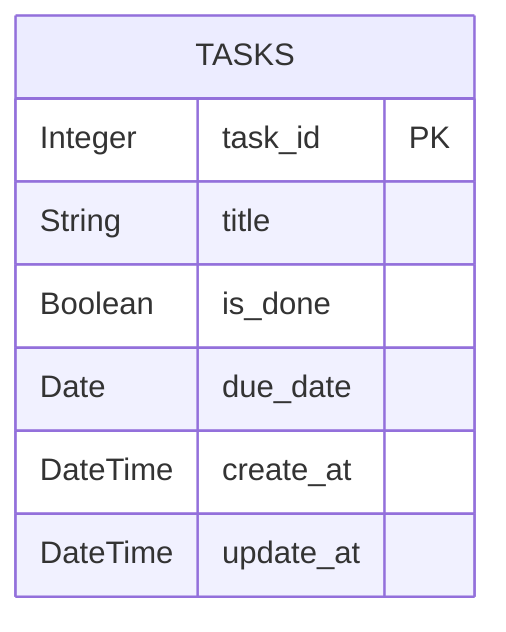
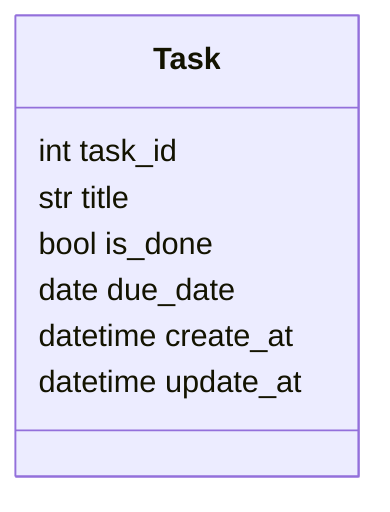

# TODO API with Database and ORM 📚

<div align=center>


</div>

## Table of Contents
- [TODO API with Database and ORM 📚](#todo-api-with-database-and-orm-)
  - [Table of Contents](#table-of-contents)
- [Project Overview](#project-overview)
- [Project Folder Structure](#project-folder-structure)
- [main.py 🚀](#mainpy-)
- [utils.py 🧰](#utilspy-)
- [database.py 🗄️](#databasepy-️)
- [Entity Structure](#entity-structure)
- [Pydantic Schemas](#pydantic-schemas)
- [API Router](#api-router)
- [API Endpoints](#api-endpoints)
  - [GET /tasks/ — Get All Tasks](#get-tasks--get-all-tasks)
  - [GET /tasks/{task\_id} — Get Task by ID](#get-taskstask_id--get-task-by-id)
  - [POST /tasks/ — Create Task](#post-tasks--create-task)
  - [DELETE /tasks/{task\_id} — Delete Task](#delete-taskstask_id--delete-task)
  - [PUT /tasks/{task\_id} — Update Task](#put-taskstask_id--update-task)
- [SQLAlchemy Task Model](#sqlalchemy-task-model)
- [Class Diagram](#class-diagram)
- [Error Handling](#error-handling)

---

# Project Overview
A FastAPI-based ToDo application using SQLite and SQLAlchemy ORM, supporting full CRUD operations with timestamps.

---

# Project Folder Structure
```
project-root/
│
├── app/
│   ├── main.py
│   ├── database.py
│   ├── utils.py
│   ├── models/
│   │   └── task.py
│   ├── schemas/
│   │   └── tasks.py
│   ├── routers/
│   │   └── task.py
│
├── todo.db
├── README.md
├── requirements.txt
└── .gitignore
```

---

# main.py 🚀
```python
from fastapi import FastAPI
from app.database import init_db
from app.routers import task

app = FastAPI()

@app.on_event('startup')
def on_startup():
    init_db()

app.include_router(task.router)
```

---

# utils.py 🧰
```python
from fastapi import HTTPException, status

def raise_error_404(entity, requested_id: int):
    if not entity:
        raise HTTPException(
            status_code=status.HTTP_404_NOT_FOUND,
            detail=f"Requested Data with id as {requested_id} not Found"
        )
```

---

# database.py 🗄️
```python
from sqlalchemy import create_engine
from sqlalchemy.orm import sessionmaker
from sqlalchemy.ext.declarative import declarative_base

DATABASE_URL = "sqlite:///./todo.db"

engine = create_engine(DATABASE_URL, connect_args={"check_same_thread": False})
SessionLocal = sessionmaker(bind=engine, autocommit=False, autoflush=False)
Base = declarative_base()

def init_db():
    Base.metadata.create_all(bind=engine)

def get_db():
    db = SessionLocal()
    try:
        yield db
    finally:
        db.close()
```

---

# Entity Structure


---

# Pydantic Schemas
```python
from pydantic import BaseModel
from datetime import date, datetime

class TaskCreate(BaseModel):
    title: str
    due_date: date

class TaskUpdate(BaseModel):
    title: str | None = None
    is_done: bool | None = None
    due_date: date | None = None

class TaskResponse(BaseModel):
    task_id: int
    title: str
    is_done: bool
    due_date: date
    create_at: datetime
    update_at: datetime | None = None

    model_config = {"from_attributes": True}
```

---

# API Router
```python
router = APIRouter(
    prefix="/tasks",
    tags=["Tasks"]
)
```

---

# API Endpoints

## GET /tasks/ — Get All Tasks
Returns a list of all tasks.

Example Response:
```
[
  {
    task_id: 1
    title: "Buy milk"
    is_done: false
    due_date: "2024-06-10"
    create_at: "2024-06-01T12:00:00"
    update_at: null
  }
]
```

---

## GET /tasks/{task_id} — Get Task by ID

Example Response:
```
task_id: 1
title: "Buy milk"
is_done: false
due_date: "2024-06-10"
create_at: "2024-06-01T12:00:00"
update_at: null
```

---

## POST /tasks/ — Create Task

Request Body:
```
title: "Buy groceries"
due_date: "2024-06-20"
```

Example Response:
```
task_id: 2
title: "Buy groceries"
is_done: false
due_date: "2024-06-20"
create_at: "2024-06-10T10:00:00"
update_at: null
```

---

## DELETE /tasks/{task_id} — Delete Task

Example Response:
```
task_id: 2
title: "Buy groceries"
is_done: false
due_date: "2024-06-20"
create_at: "2024-06-10T10:00:00"
update_at: null
```

---

## PUT /tasks/{task_id} — Update Task

Request Body:
```
title: "Buy milk and eggs"
is_done: true
```

Example Response:
```
task_id: 1
title: "Buy milk and eggs"
is_done: true
due_date: "2024-06-10"
create_at: "2024-06-01T12:00:00"
update_at: "2024-06-10T18:30:00"
```

---

# SQLAlchemy Task Model
```python
from sqlalchemy import Column, Integer, String, DateTime, Boolean, func, Date
from app.database import Base

class Task(Base):
    __tablename__ = "tasks"

    task_id = Column(Integer, primary_key=True, index=True)
    title = Column(String, nullable=False)
    is_done = Column(Boolean, default=False)
    due_date = Column(Date)
    create_at = Column(DateTime, default=func.now())
    update_at = Column(DateTime, default=func.now(), onupdate=func.now())
```

---

# Class Diagram


---

# Error Handling
All endpoints return HTTP 404 using `raise_error_404` when the requested task does not exist.
